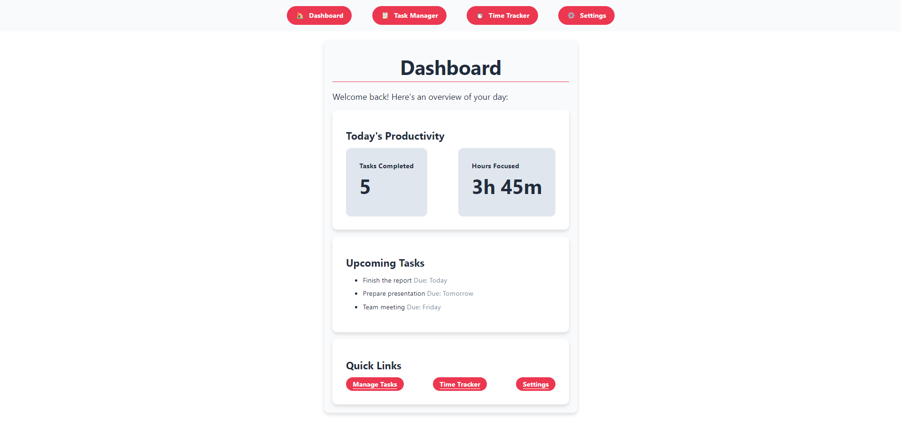

# FocusFlow

FocusFlow is a task management and productivity tool designed to help you stay organized and on track. It features a task manager, time tracker, and customizable settings, all integrated with a Pomodoro timer for efficient work sessions.

## Table of Contents

- [Features](#features)
- [Installation](#installation)
- [Usage](#usage)
- [Screenshots](#screenshots)
- [Technologies Used](#technologies-used)
- [Contributing](#contributing)
- [License](#license)

## Features

- **Task Manager**: Create, edit, and delete tasks. Organize them by priority and due date.
- **Time Tracker**: Track the time spent on each task and manage your work sessions.
- **Settings**: Customize work duration, break times, notifications, and theme preferences.
- **Responsive Design**: Fully responsive layout optimized for both desktop and mobile devices.
- **Pomodoro Timer**: Built-in Pomodoro timer to help you focus during work sessions.

## Installation

To get started with FocusFlow, follow these steps:

1. **Clone the repository:**
   ```bash
   git clone https://github.com/yourusername/focusflow.git
   cd focusflow
2. **Install dependencies**:
   npm install
3. **Start the development server**:
   npm start
4. **Build for production**:
   npm run build

## Usage
1. Task Manager: Navigate to the Task Manager to add tasks, set priorities, and due dates. Tasks can be edited or deleted as needed.

2. Time Tracker: Use the Time Tracker to log the time spent on tasks. You can manually add time to tasks to reflect your work accurately.

3. Settings: Customize your Pomodoro timer, notifications, and theme settings to match your workflow. All settings are saved locally for future sessions.

## Screenshots


## Technologies Used
- React: A JavaScript library for building user interfaces.

- React Router: For routing and navigation between different pages.

- CSS: For styling the application, including a custom theme.
Local Storage: To persist user settings across sessions.